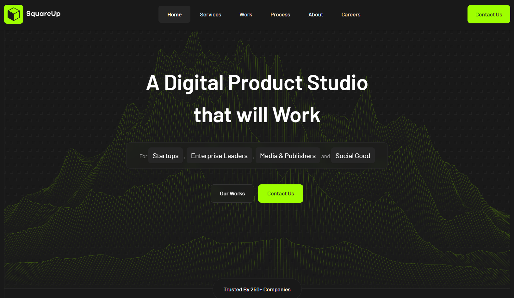

# ✅ SquareUp - Digital Agency

Многостраничный лендинг для цифрового агентства.

## 🖼️ Дизайн

Бесплатный макет из Figma.



🔗 [Ссылка на макет в Figma](https://www.figma.com/design/ZVqzCg7YDWDjNqqwHwrJY7/Digital-Agency-Company-Website-UI-Design-Template-in-Dark-Theme---FREE-Editable----Community-?t=RxXj3F4osiKQf5od-0)

## 🛠️ Технологии

- HTML
- SASS/SCSS
- JavaScript
- BEM
- Accessibility

## ✨ Реализовано

### 🍔 Бургер-меню
Меню с блокировкой скролла при открытии.

### ✅ Валидация формы 
Кастомная проверка полей ввода на JavaScript с выводом ошибок.

### 🎚️ Диапазонный слайдер
Двойной ползунок выбора бюджета.

### 🎨 Современный CSS
- Использованы псевдоклассы `:user-invalid` `:has()`
- Scroll-driven animations (шапке добавляется тень при прокрутке)
- Аккордеоны на `<details>`
- Резиновая вёрстка
- `rem` единицы измерения для доступности

## 🚀 Запуск

1. 🔗 [Открыть сайт](https://daniltyrtychnyi.github.io/square-up/)

2. Клонировать репозиторий:
```bash
git clone git@github.com:daniltyrtychnyi/square-up.git
```
3. Открыть `index.html` в браузере.
