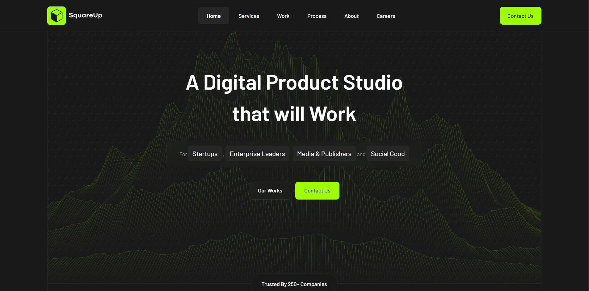

# ✅ SquareUp — Digital Agency

Многостраничный сайт цифрового агентства.

## 🖼️ Дизайн

За основу интерфейса был взят дизайн из бесплатного макета Figma.



🔗 [Ссылка на макет в Figma](https://www.figma.com/design/gZCvperA9OG1xYfQv7LEKa/Digital-Agency-Company-Website-UI-Design-Template-in-Dark-Theme---FREE-Editable----Community-?node-id=3-53&p=f&t=pUqBGTbWoIJfaOyJ-0)

## 🛠️ Технологии

- **HTML5**
- **SCSS**
- **JavaScript (ES6+)**
- **BEM**
- **Accessibility**

## ✨ Реализовано

- Многостраничная структура сайта.
- Адаптивная вёрстка под разные разрешения экрана.
- Клиентская валидация формы.
- Диапазонный слайдер выбора бюджета.

## 🎯 Цель проекта

Практическая реализация многостраничного сайта по готовому UI-дизайну с акцентом на семантическую HTML-разметку, адаптивную вёрстку, БЭМ и доступность интерфейса.

Проект выполнен для закрепления навыков вёрстки и работы с интерактивными элементами на JavaScript.

## 🚀 Запуск

1. 🔗 [Открыть сайт](https://daniltyrtychnyi.github.io/square-up/)

2. Клонировать репозиторий:

```bash
git clone https://github.com/daniltyrtychnyi/square-up.git
```

3. Запустить проект через локальный сервер:
    - **Visual Studio Code** — установить
      расширение [Live Server](https://marketplace.visualstudio.com/items?itemName=ritwickdey.LiveServer), правый клик
      на `index.html` → *Open with Live Server*
    - **WebStorm** — запустить проект через встроенный локальный сервер
